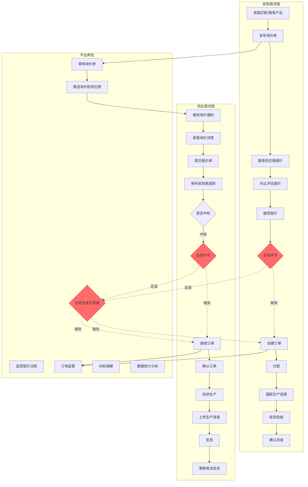
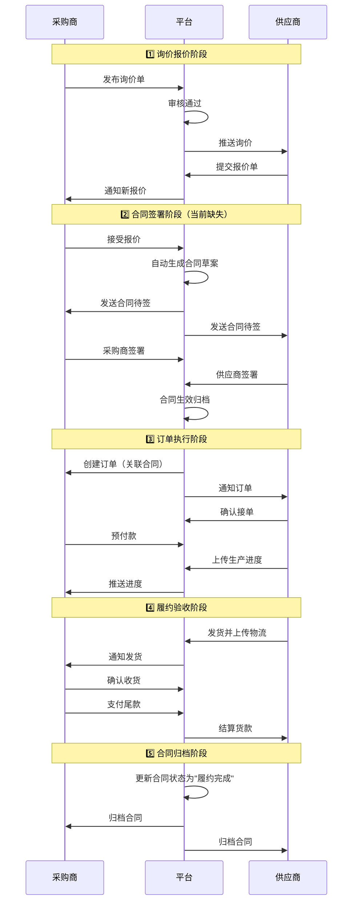

# 易采贸易平台交易闭环完整性分析报告

## 📊 一、当前交易闭环流程图



## 🔴 二、发现的核心问题

### 1. **合同模块缺失（严重）**

#### 问题现状：
- ✅ 数据库层面：`t_order` 表有 `contract_url` 字段
- ✅ 前端界面：有合同签署、查看合同的UI入口
- ❌ **后端实体类**：`Order.java` **没有 `contractUrl` 字段**
- ❌ **业务逻辑**：完全缺失合同生成、签署、管理的Service层
- ❌ **API接口**：没有合同相关的Controller

#### 缺失的合同功能：
```
1. 合同生成（基于报价单自动生成）
2. 合同模板管理
3. 电子签章/签名
4. 合同版本管理
5. 合同状态流转（待签署→已签署→履约中→完成）
6. 合同变更申请
7. 合同终止处理
```

### 2. **交易闭环断层**

#### 当前流程断层点：
```
采购商接受报价 → [断层] → 直接创建订单

缺失环节：
├── 合同自动生成
├── 双方合同审核
├── 电子签署
├── 合同归档
└── 合同关联订单
```

### 3. **角色互动不完整**

#### 采购商角色缺失：
- ❌ 合同签署确认
- ❌ 合同变更申请
- ❌ 合同履约监督

#### 供应商角色缺失：
- ❌ 合同确认签署
- ❌ 合同履约更新
- ❌ 合同争议处理

#### 平台角色缺失：
- ❌ 合同审核管理
- ❌ 合同模板维护
- ❌ 合同纠纷仲裁
- ❌ 合同法律效力认证

## 🎯 三、完整交易闭环应有的流程



## 📋 四、需要补充的数据表结构

### 4.1 合同主表
```sql
CREATE TABLE t_contract (
    id BIGINT AUTO_INCREMENT PRIMARY KEY,
    contract_no VARCHAR(50) NOT NULL UNIQUE COMMENT '合同编号',
    inquiry_id BIGINT COMMENT '关联询价单ID',
    quotation_id BIGINT COMMENT '关联报价单ID',
    buyer_id BIGINT NOT NULL COMMENT '采购商ID',
    supplier_id BIGINT NOT NULL COMMENT '供应商ID',
    contract_type VARCHAR(20) DEFAULT 'PURCHASE' COMMENT '合同类型',
    total_amount DECIMAL(12,2) NOT NULL COMMENT '合同总金额',
    currency VARCHAR(10) DEFAULT 'CNY' COMMENT '币种',
    
    -- 合同内容
    contract_title VARCHAR(200) COMMENT '合同标题',
    contract_content TEXT COMMENT '合同正文内容',
    template_id BIGINT COMMENT '使用的模板ID',
    
    -- 签署状态
    status VARCHAR(20) DEFAULT 'DRAFT' COMMENT '合同状态: DRAFT/PENDING_BUYER/PENDING_SUPPLIER/SIGNED/EXECUTING/COMPLETED/TERMINATED',
    buyer_signed_at DATETIME COMMENT '采购商签署时间',
    buyer_signature TEXT COMMENT '采购商签名/签章',
    supplier_signed_at DATETIME COMMENT '供应商签署时间',
    supplier_signature TEXT COMMENT '供应商签名/签章',
    
    -- 履约信息
    start_date DATE COMMENT '合同生效日期',
    end_date DATE COMMENT '合同到期日期',
    delivery_date DATE COMMENT '交付日期',
    payment_terms TEXT COMMENT '付款条款',
    
    -- 文件存储
    contract_pdf_url VARCHAR(500) COMMENT '合同PDF文件URL',
    contract_hash VARCHAR(128) COMMENT '合同内容哈希（防篡改）',
    
    -- 关联订单
    order_id BIGINT COMMENT '关联订单ID',
    
    -- 平台监管
    platform_reviewed BOOLEAN DEFAULT FALSE COMMENT '平台是否审核',
    platform_reviewer_id BIGINT COMMENT '平台审核人ID',
    platform_reviewed_at DATETIME COMMENT '平台审核时间',
    
    remark TEXT COMMENT '备注',
    created_at DATETIME DEFAULT CURRENT_TIMESTAMP,
    updated_at DATETIME DEFAULT CURRENT_TIMESTAMP ON UPDATE CURRENT_TIMESTAMP,
    
    INDEX idx_contract_no (contract_no),
    INDEX idx_inquiry_id (inquiry_id),
    INDEX idx_quotation_id (quotation_id),
    INDEX idx_buyer_id (buyer_id),
    INDEX idx_supplier_id (supplier_id),
    INDEX idx_order_id (order_id),
    INDEX idx_status (status),
    
    CONSTRAINT fk_contract_inquiry FOREIGN KEY (inquiry_id) REFERENCES t_inquiry(id),
    CONSTRAINT fk_contract_quotation FOREIGN KEY (quotation_id) REFERENCES t_quotation(id),
    CONSTRAINT fk_contract_buyer FOREIGN KEY (buyer_id) REFERENCES t_buyer(id),
    CONSTRAINT fk_contract_supplier FOREIGN KEY (supplier_id) REFERENCES t_supplier(id),
    CONSTRAINT fk_contract_order FOREIGN KEY (order_id) REFERENCES t_order(id)
) ENGINE=InnoDB DEFAULT CHARSET=utf8mb4 COMMENT='交易合同主表';
```

### 4.2 合同变更记录表
```sql
CREATE TABLE t_contract_change_log (
    id BIGINT AUTO_INCREMENT PRIMARY KEY,
    contract_id BIGINT NOT NULL COMMENT '合同ID',
    change_type VARCHAR(20) NOT NULL COMMENT '变更类型: AMENDMENT/TERMINATION/EXTENSION',
    change_reason TEXT COMMENT '变更原因',
    initiator_type VARCHAR(20) COMMENT '发起方: BUYER/SUPPLIER/PLATFORM',
    initiator_id BIGINT COMMENT '发起人ID',
    old_content TEXT COMMENT '变更前内容',
    new_content TEXT COMMENT '变更后内容',
    status VARCHAR(20) DEFAULT 'PENDING' COMMENT '变更状态: PENDING/APPROVED/REJECTED',
    approved_at DATETIME COMMENT '审批时间',
    created_at DATETIME DEFAULT CURRENT_TIMESTAMP,
    
    INDEX idx_contract_id (contract_id),
    CONSTRAINT fk_change_contract FOREIGN KEY (contract_id) REFERENCES t_contract(id)
) ENGINE=InnoDB DEFAULT CHARSET=utf8mb4 COMMENT='合同变更记录表';
```

### 4.3 合同模板表
```sql
CREATE TABLE t_contract_template (
    id BIGINT AUTO_INCREMENT PRIMARY KEY,
    template_name VARCHAR(100) NOT NULL COMMENT '模板名称',
    template_code VARCHAR(50) NOT NULL UNIQUE COMMENT '模板代码',
    template_type VARCHAR(20) COMMENT '模板类型: STANDARD/CUSTOM',
    template_content TEXT NOT NULL COMMENT '模板内容（支持变量）',
    variables JSON COMMENT '模板变量定义',
    category VARCHAR(50) COMMENT '适用品类',
    is_active BOOLEAN DEFAULT TRUE COMMENT '是否启用',
    version VARCHAR(20) COMMENT '版本号',
    created_by BIGINT COMMENT '创建人ID',
    created_at DATETIME DEFAULT CURRENT_TIMESTAMP,
    updated_at DATETIME DEFAULT CURRENT_TIMESTAMP ON UPDATE CURRENT_TIMESTAMP,
    
    INDEX idx_template_code (template_code),
    INDEX idx_category (category)
) ENGINE=InnoDB DEFAULT CHARSET=utf8mb4 COMMENT='合同模板表';
```

## 🛠️ 五、需要开发的功能模块

### 5.1 合同管理模块（Contract Module）

#### 实体类（Entity）
- `Contract.java` - 合同主实体
- `ContractChangeLog.java` - 合同变更记录
- `ContractTemplate.java` - 合同模板

#### 仓储层（Repository）
- `ContractRepository.java`
- `ContractChangeLogRepository.java`
- `ContractTemplateRepository.java`

#### DTO
- `ContractCreateRequest.java` - 创建合同请求
- `ContractResponse.java` - 合同响应
- `ContractSignRequest.java` - 签署合同请求
- `ContractChangeRequest.java` - 变更申请请求
- `ContractTemplateRequest.java` - 模板管理请求

#### Service层
```java
public interface ContractService {
    // 合同生成（基于报价单）
    ContractResponse generateFromQuotation(Long quotationId);
    
    // 合同签署
    ContractResponse signContract(Long contractId, Long userId, String userType, String signature);
    
    // 查询合同
    ContractResponse getContract(Long contractId);
    PageResult<ContractResponse> listBuyerContracts(Long buyerId, String status, int page, int size);
    PageResult<ContractResponse> listSupplierContracts(Long supplierId, String status, int page, int size);
    
    // 合同变更
    void applyChange(ContractChangeRequest request);
    void approveChange(Long changeLogId, Long approverId);
    void rejectChange(Long changeLogId, String reason);
    
    // 合同终止
    void terminateContract(Long contractId, String reason);
    
    // 合同履约状态更新
    void updateExecutionStatus(Long contractId, String status);
    
    // 合同模板管理
    ContractTemplateResponse createTemplate(ContractTemplateRequest request);
    List<ContractTemplateResponse> listTemplates(String category);
}
```

#### Controller层
```java
@RestController
@RequestMapping("/api/contracts")
public class ContractController {
    @PostMapping("/generate/{quotationId}")
    @PostMapping("/{id}/sign")
    @GetMapping("/{id}")
    @GetMapping("/buyer/{buyerId}")
    @GetMapping("/supplier/{supplierId}")
    @PostMapping("/{id}/change")
    @PostMapping("/{id}/terminate")
    // ...
}
```

### 5.2 Order实体类补充

需要在 `Order.java` 中添加：
```java
@Column(name = "contract_url", length = 255)
private String contractUrl;

@Column(name = "payment_status", length = 20)
@Builder.Default
private String paymentStatus = "UNPAID";

@Column(name = "payment_method", length = 50)
private String paymentMethod;

@Column(name = "required_delivery_date")
private LocalDate requiredDeliveryDate;

@Column(name = "estimated_delivery_date")
private LocalDate estimatedDeliveryDate;

@Column(name = "actual_delivery_date")
private LocalDate actualDeliveryDate;

@Column(name = "tracking_number", length = 100)
private String trackingNumber;

@Column(name = "logistics_company", length = 100)
private String logisticsCompany;

@Column(name = "invoice_url", length = 255)
private String invoiceUrl;
```

### 5.3 业务流程调整

#### 当前流程：
```
接受报价 → 创建订单
```

#### 修改后流程：
```
接受报价 → 生成合同 → 双方签署 → 创建订单（关联合同）
```

#### InquiryService 需要添加：
```java
// 接受报价（触发合同生成）
ContractResponse acceptQuotation(Long quotationId, Long buyerId);
```

#### OrderService 需要修改：
```java
// 创建订单时必须关联合同
OrderResponse createOrderFromContract(Long contractId);
```

## 📈 六、平台角色功能补充

### 6.1 平台管理后台功能
```
1. 合同审核管理
   ├── 待审核合同列表
   ├── 合同详情审核
   ├── 审核通过/拒绝
   └── 审核日志

2. 合同模板管理
   ├── 标准模板库
   ├── 模板编辑器
   ├── 模板变量配置
   └── 模板版本控制

3. 交易纠纷处理
   ├── 纠纷申诉入口
   ├── 证据材料上传
   ├── 平台调解
   └── 仲裁结果执行

4. 交易数据监控
   ├── 实时交易大屏
   ├── 合同签署率统计
   ├── 订单履约率统计
   └── 纠纷率分析
```

### 6.2 Dashboard补充指标
```java
public class DashboardStatsDTO {
    // 现有指标
    private Long totalOrders;
    private Long activeSuppliers;
    // ...
    
    // 新增合同相关指标
    private Long totalContracts;           // 合同总数
    private Long pendingContracts;         // 待签署合同
    private Long executingContracts;       // 履约中合同
    private BigDecimal contractAmount;     // 合同总金额
    private Double contractSignRate;       // 合同签署率
    private Double contractFulfillRate;    // 合同履约率
    private Long disputeCount;             // 纠纷数量
}
```

## ✅ 七、优先级行动计划

### Phase 1: 核心合同功能（高优先级）
```
Week 1-2:
□ 创建数据库表（t_contract, t_contract_change_log, t_contract_template）
□ 开发Contract实体类和Repository
□ 补充Order实体类缺失字段
□ 实现合同生成Service（基于报价单）
□ 实现合同签署Service
```

### Phase 2: 业务流程闭环（高优先级）
```
Week 3:
□ 修改InquiryService.acceptQuotation()触发合同生成
□ 修改OrderService.createOrder()要求关联合同
□ 实现合同状态流转逻辑
□ 开发ContractController API接口
```

### Phase 3: 前端集成（中优先级）
```
Week 4:
□ 个人中心-合同管理页面API对接
□ 供应商中心-合同管理API对接
□ 合同签署页面功能完善
□ 合同查看/下载功能
```

### Phase 4: 平台管理（中优先级）
```
Week 5:
□ 平台管理后台-合同审核功能
□ 合同模板管理界面
□ Dashboard合同统计指标
□ 纠纷申诉入口
```

### Phase 5: 高级功能（低优先级）
```
Week 6+:
□ 电子签章/CA认证集成
□ 合同变更工作流
□ 合同法律效力增强
□ 区块链存证（可选）
```

## 🎯 八、总结

### 当前问题：
1. ❌ **合同模块完全缺失** - 无后端实体、Service、API
2. ❌ **Order实体类字段不完整** - 缺失支付、物流、合同关联字段
3. ❌ **交易流程断层** - 报价→订单之间缺少合同环节
4. ❌ **平台角色缺位** - 无合同审核、纠纷处理机制

### 完整闭环应包含：
```
询价 → 报价 → [合同生成] → [合同签署] → 订单创建 → 
支付 → 生产 → 发货 → 验收 → [合同履约完成] → 归档
```

### 建议：
**立即启动Phase 1和Phase 2**，补充合同模块的核心功能，打通交易闭环的关键断层，确保交易流程的法律效力和平台监管能力。
